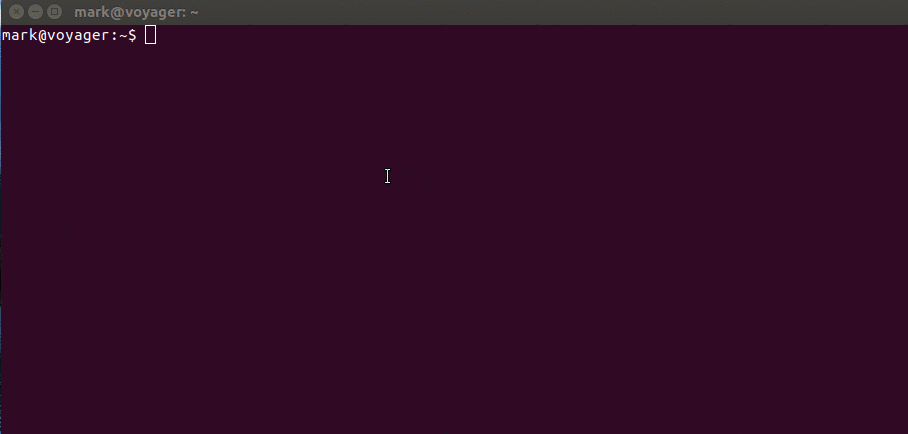

# kubesh
A bash script to create a useful shell environment for working with kubernetes using kubectl. Modifies the prompt to include the current context name to make it easy to know what cluster you're working on, and also provides several convenience functions to make it easy to switch between contexts.



## Install

Just clone the repo or simply copy the `kubesh` script somewhere on your path and mark it executable (`chmod 755 kubesh`). Then run the script to create the shell environment. Requires kubectl and sed.

## Use

```
NAME
  kubesh 0.3.2 - sets up a shell environment for kubernetes kubectl tool with a
  number of useful commands.

SYNOPSIS
  kubesh [-h] [-i] [-p]

DESCRIPTION
  Kubesh displays the current kubernetes context in the shell prompt and adds
  some commands to make it easier to switch between contexts. Run kubesh and
  type 'help' at the shell prompt for more information on commands.

OPTIONAL ARGUMENTS
  -h
    Display this help. All other arguments are ignored.
  -i
    Do not attempt to use inotifywait (if installed) to monitor changes to the
    kubectl config files.
  -p
    Start with the context prompt disabled. The current context can be shown
    by typing 'context' at the shell prompt.
```
## Monitoring external changes to kube config

The main point of this shell is to make it very hard to be mistaken about what kubectl context your next command will run in, and to a lesser extent to make it easy to list and switch between contexts. Under normal operation with inotify-tools installed the script will set up a coproc in the child shell to monitor changes to all of the kubectl config files (including paths specified in $KUBECONFIG). If a change is detected the script will recheck the current context, and if it has changed will notify the user then restart the child shell.

If the inotify-tools package is not installed, or the user passes the `-i` command line argument to disable it, then the shell will not monitor changes to the kubectl config, and it is possible that an external action will change it, making kubesh's prompt display a lie and causing your next command to be run somewhere other than expected. For this reason it is recommended to use inotify-tools, and the user will be warned at startup if monitoring is not available, does not work, or is disabled.

## History

  - 0.1.0 (4/17/2017): initial release
  - 0.2.0 (4/19/2017): added ability to toggle the prompt display on/off
  - 0.2.1 (4/19/2017): sourced .bashrc in subshell so aliases would work
  - 0.2.2 (4/22/2017): handle the case where no kubectl context exists at start
  - 0.3.0 (4/27/2017): now watches the kubeconfig for external changes and reboots the shell
  - 0.3.1 (5/27/2017): fixed issue with subshell active context getting out of sync
  - 0.3.2 (5/27/2017): show the number the user presses when selecting a context

## PR's welcome!
